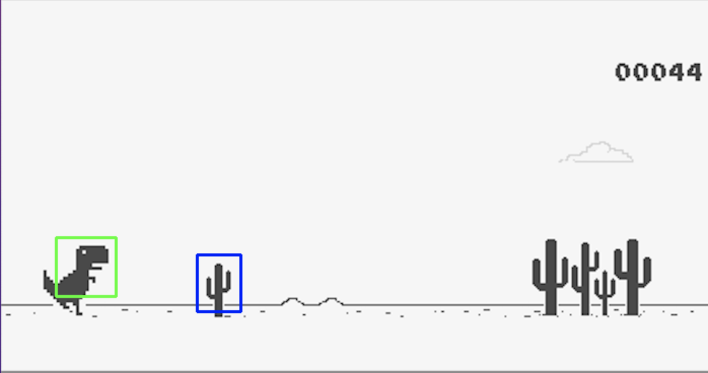
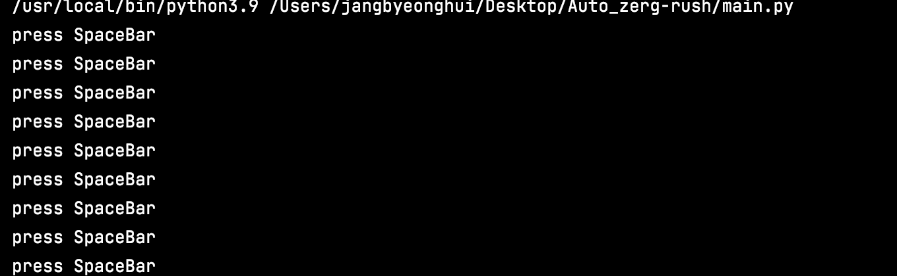

# Auto_zerg-rush
자동으로 미션을 zerg가 아니라 T REX 인 것을 검색해서 알았습니다. 제목부터 근본이 없는 프로젝트 입니다.
템플릿 매칭으로 게임 속 내에서 사물을 인식하여 자동으로 동작하는 개발입니다.

## 실제 동작
매칭 결과 이미지


키보드 입력 결과


## 결과
템플릿 매칭이라는 것을 발견해서 시도한 개발이었지만, 생각한 것보다 정확도면이 부족하다. 심지어 컬러 이미지가
아니라 흑백 이미지 임에도 불구하고도 정확도가 떨어지며, 실시간 처리면에서도 부족해서 자동으로 게임을 하기에는 다른 방법을 고려해야 할 것 같다.

## 실행 방법

```
git clone https://github.com/jangByeongHui/Auto_T-Rex.git

cd Auto_T-Rex

# 게임 픽셀 좌표 설정 후 pic = pyautogui.screenshot(region=(0, 0,1280, 720))
python main.py

```